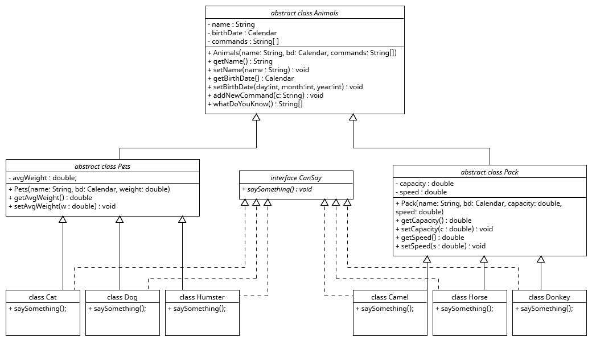

## Контрольная работа по блоку специализация
## Белотелов Максим
__________________________________________

1. Используя команду cat в терминале операционной системы Linux, создать
два файла Домашние животные (заполнив файл собаками, кошками,
хомяками) и Вьючные животными заполнив файл Лошадьми, верблюдами и
ослы), а затем объединить их. Просмотреть содержимое созданного файла.
Переименовать файл, дав ему новое имя (Друзья человека)

```
maksim@maksim-VirtualBox:~$ cat > pets
Собака
Кошка
Хомяк
Черепаха
Попугай
maksim@maksim-VirtualBox:~$ cat > pack
Лошадь
Осел
Верблюд
maksim@maksim-VirtualBox:~$ cat pets pack > animals
maksim@maksim-VirtualBox:~$ cat animals
Собака
Кошка
Хомяк
Черепаха
Попугай
Лошадь
Осел
Верблюд
maksim@maksim-VirtualBox:~$ mv animals humans-friends
```
2. Создать директорию, переместить файл туда.
```
maksim@maksim-VirtualBox:~$ mkdir animals-dir
maksim@maksim-VirtualBox:~$ mv humans-friends ./animals-dir/
```
3. Подключить дополнительный репозиторий MySQL. Установить любой пакет из него.
```
maksim@maksim-VirtualBox:/tmp$ sudo wget -c https://dev.mysql.com/get/mysql-apt-config_0.8.26-1_all.deb
maksim@maksim-VirtualBox:/tmp$ sudo dpkg -i mysql-apt-config_0.8.26-1_all.deb
maksim@maksim-VirtualBox:/tmp$ nano /etc/apt/sources.list.d/mysql.list
maksim@maksim-VirtualBox:/tmp$ sudo apt update
Сущ:1 http://ru.archive.ubuntu.com/ubuntu jammy InRelease
Пол:2 http://ru.archive.ubuntu.com/ubuntu jammy-updates InRelease [119 kB]
Сущ:3 http://ru.archive.ubuntu.com/ubuntu jammy-backports InRelease
Сущ:4 https://download.docker.com/linux/ubuntu jammy InRelease
Пол:5 http://repo.mysql.com/apt/ubuntu jammy InRelease [20,3 kB]
Пол:6 http://security.ubuntu.com/ubuntu jammy-security InRelease [110 kB]
Пол:7 http://repo.mysql.com/apt/ubuntu jammy/mysql-8.0 Sources [963 B]
Пол:8 http://security.ubuntu.com/ubuntu jammy-security/main amd64 DEP-11 Metadata [43,1 kB]
Пол:9 http://repo.mysql.com/apt/ubuntu jammy/mysql-apt-config amd64 Packages [565 B]
Пол:10 http://repo.mysql.com/apt/ubuntu jammy/mysql-apt-config i386 Packages [565 B]
Пол:11 http://security.ubuntu.com/ubuntu jammy-security/universe amd64 DEP-11 Metadata [40,1 kB]
Пол:12 http://repo.mysql.com/apt/ubuntu jammy/mysql-8.0 amd64 Packages [12,7 kB]
Пол:13 http://repo.mysql.com/apt/ubuntu jammy/mysql-tools amd64 Packages [8 011 B]
Пол:14 http://repo.mysql.com/apt/ubuntu jammy/mysql-tools i386 Packages [457 B]
maksim@maksim-VirtualBox:/tmp$ sudo apt install mysql-server
maksim@maksim-VirtualBox:/tmp$ systemctl status mysql
● mysql.service - MySQL Community Server
     Loaded: loaded (/lib/systemd/system/mysql.service; enabled; vendor preset: enabled)
     Active: active (running) since Sat 2023-09-16 11:25:41 MSK; 1min 20s ago
       Docs: man:mysqld(8)
             http://dev.mysql.com/doc/refman/en/using-systemd.html
   Main PID: 6673 (mysqld)
     Status: "Server is operational"
      Tasks: 37 (limit: 2261)
     Memory: 360.5M
        CPU: 3.954s
     CGroup: /system.slice/mysql.service
             └─6673 /usr/sbin/mysqld

сен 16 11:25:39 maksim-VirtualBox systemd[1]: Starting MySQL Community Server...
сен 16 11:25:41 maksim-VirtualBox systemd[1]: Started MySQL Community Server.
```
4. Установить и удалить deb-пакет с помощью dpkg
```
maksim@maksim-VirtualBox:/tmp$ wget https://download.virtualbox.org/virtualbox/7.0.10/virtualbox-7.0_7.0.10-158379~Ubuntu~jammy_amd64.deb
maksim@maksim-VirtualBox:/tmp$ sudo dpkg -i virtualbox-7.0_7.0.10-158379~Ubuntu~jammy_amd64.deb
maksim@maksim-VirtualBox:/tmp$ sudo apt -f install
maksim@maksim-VirtualBox:/tmp$ sudo dpkg -r virtualbox-7.0
maksim@maksim-VirtualBox:/tmp$ sudo dpkg -P virtualbox-7.0
```
5. Выложить историю команд в терминале Ubuntu.
6. Нарисовать диаграмму, в которой есть класс родительский класс, домашние
животные и вьючные животные, в составы которых в случае домашних
животных войдут классы: собаки, кошки, хомяки, а в класс вьючные животные
войдут: Лошади, верблюды и ослы)

7. Создать в MySQL базу данных "Друзья человека".
```sql
CREATE DATABASE humans_friends;
USE humans_friends;
```
8. Создать таблицы с иерархией из диаграммы в БД
```sql
CREATE TABLE animals(
    id INT PRIMARY KEY AUTO_INCREMENT,
    animal_type VARCHAR(10));

INSERT animals(animal_type)
VALUES ('Домашние'), ('Вьючные');

CREATE TABLE pets(
    id INT PRIMARY KEY AUTO_INCREMENT,
    pets_name VARCHAR(30),
    type_id INT,
    FOREIGN KEY (type_id) REFERENCES animals (id));

INSERT pets(pets_name, type_id)
VALUES ('Кошки', 1), ('Собаки', 1), ('Хомяки', 1);

CREATE TABLE pack(
    id INT PRIMARY KEY AUTO_INCREMENT,
    packs_name VARCHAR(30),
    type_id INT,
    FOREIGN KEY (type_id) REFERENCES animals(id));

INSERT pack(packs_name, type_id)
VALUES ('Лошади', 2), ('Ослы', 2), ('Верблюды', 2);

CREATE TABLE cats(
    id INT AUTO_INCREMENT PRIMARY KEY,
    `name` VARCHAR(15),
    birth_day DATE,
    commands VARCHAR(40),
    type_id int,
    avg_weight DOUBLE,
    FOREIGN KEY(type_id) REFERENCES pets(id));
    
CREATE TABLE dogs(
    id INT AUTO_INCREMENT PRIMARY KEY,
    `name` VARCHAR(15),
    birth_day DATE,
    commands VARCHAR(40),
    type_id INT,
	avg_weight DOUBLE,
    FOREIGN KEY(type_id) REFERENCES pets(id));
    
CREATE TABLE hamsters(
    id INT AUTO_INCREMENT PRIMARY KEY,
    `name` VARCHAR(15),
    birth_day DATE,
    commands VARCHAR(40),
    type_id INT,
	avg_weight DOUBLE,
    FOREIGN KEY(type_id) REFERENCES pets(id));

CREATE TABLE camels(
    id INT AUTO_INCREMENT PRIMARY KEY,
    `name` VARCHAR(15),
    birth_day DATE,
    commands VARCHAR(40),
    type_id INT,
    capacity DOUBLE,
    speed DOUBLE,
    FOREIGN KEY(type_id) REFERENCES pets(id));

CREATE TABLE horses(
    id INT AUTO_INCREMENT PRIMARY KEY,
    `name` VARCHAR(15),
    birth_day DATE,
    commands VARCHAR(40),
    type_id INT,
    capacity DOUBLE,
    speed DOUBLE,
    FOREIGN KEY(type_id) REFERENCES pets(id));

CREATE TABLE donkeys(
    id INT AUTO_INCREMENT PRIMARY KEY,
    `name` VARCHAR(15),
    birth_day DATE,
    commands VARCHAR(40),
    type_id INT,
    capacity DOUBLE,
    speed DOUBLE,
    FOREIGN KEY(type_id) REFERENCES pets(id));
```
9. Заполнить низкоуровневые таблицы именами(животных), командами,
которые они выполняют, и датами рождения
```sql
INSERT cats(`name`, birth_day, commands, avg_weight, type_id)
VALUES ('Вася', '2020-03-12', 'брысь', 4.2, 1), ('Филя', '2019-04-13', 'тапки, кыс', 5.1, 1);

INSERT dogs(`name`, birth_day, commands, avg_weight, type_id)
VALUES ('Бобик', '2018-05-14', 'сидеть, лежать', 20.5, 2), ('Шарик', '2019-06-15', 'рядом, голос, сидеть', 23.1, 2), ('Мухтар', '2017-07-16', 'лежать', 26, 2);

INSERT hamsters(`name`, birth_day, commands, avg_weight, type_id)
VALUES ('Рыжик', '2022-09-03', '', 0.025, 3), ('Зола', '2022-11-05', '', 0.065, 3);

INSERT camels(`name`, birth_day, commands, type_id, capacity, speed)
VALUES ('Горбач', '2021-05-10', 'вперед', 2, 180, 5), ('Людвиг', '2019-12-11', 'вперед, стой', 2, 180, 5);

INSERT horses(`name`, birth_day, commands, type_id, capacity, speed)
VALUES ('Молния', '2020-06-20', 'прр', 2, 800, 25);

INSERT donkeys(`name`, birth_day, commands, type_id, capacity, speed)
VALUES ('Ишак', '2020-06-20', 'вперед, стой', 2, 2000, 10);
```
10. Удалить из таблицы верблюдов, т.к. верблюдов решили перевезти в другой
питомник на зимовку. Объединить таблицы лошади, и ослы в одну таблицу.
```sql
TRUNCATE TABLE camels;

CREATE TABLE horses_and_donkeys AS
SELECT * FROM horses
UNION
SELECT * FROM donkeys;
```
11.Создать новую таблицу “молодые животные” в которую попадут все
животные старше 1 года, но младше 3 лет и в отдельном столбце с точностью
до месяца подсчитать возраст животных в новой таблице.
```sql
CREATE TABLE young_animals AS
SELECT *, TIMESTAMPDIFF(MONTH, birth_day, CURDATE()) AS `age(monthes)`
FROM(SELECT `name`, birth_day, commands, type_id FROM cats
UNION
SELECT `name`, birth_day, commands, type_id FROM dogs
UNION
SELECT `name`, birth_day, commands, type_id FROM hamsters
UNION
SELECT `name`, birth_day, commands, type_id FROM horses
UNION
SELECT `name`, birth_day, commands, type_id FROM donkeys) table_younganimals
HAVING `age(monthes)` BETWEEN 12 AND 36;
```
12.  Объединить все таблицы в одну, сохраняя поля, указывающие на прошлую принадлежность к старым таблицам.
```sql
CREATE TABLE union_table AS
SELECT *
FROM(SELECT id, `name`, birth_day, commands, type_id FROM cats 
	UNION
	SELECT id, `name`, birth_day, commands, type_id FROM dogs
	UNION
	SELECT id, `name`, birth_day, commands, type_id FROM hamsters
	UNION
	SELECT id, `name`, birth_day, commands, type_id FROM horses
	UNION
	SELECT id, `name`, birth_day, commands, type_id FROM donkeys) un;
```
13. Создать класс с Инкапсуляцией методов и наследованием по диаграмме.    

14. Написать программу, имитирующую работу реестра домашних животных.
В программе должен быть реализован следующий функционал:    
    14.1 Завести новое животное    
    14.2 определять животное в правильный класс    
    14.3 увидеть список команд, которое выполняет животное    
    14.4 обучить животное новым командам    
    14.5 Реализовать навигацию по меню     

15. Создайте класс Счетчик, у которого есть метод add(), увеличивающий̆
    значение внутренней̆ int переменной̆ на 1 при нажатие “Завести новое
    животное” Сделайте так, чтобы с объектом такого типа можно было работать в
    блоке try-with-resources. Нужно бросить исключение, если работа с объектом
    типа счетчик была не в ресурсном try и/или ресурс остался открыт. Значение
    считать в ресурсе try, если при заведения животного заполнены все поля.

